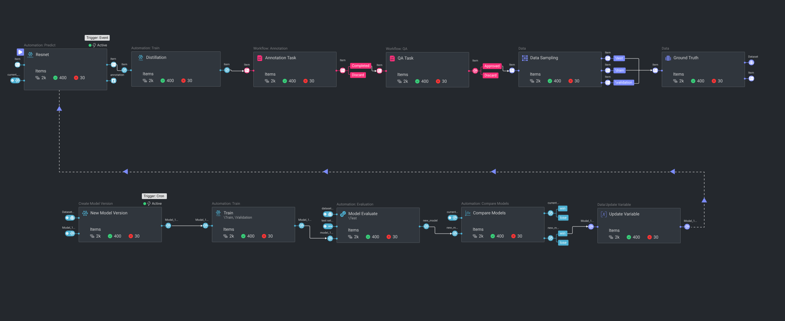

# Active Learning

Active learning is a subset of supervised learning that involves selecting the most informative data points for the
model to train on. In active learning pipelines, the model is initially trained on a small labeled dataset, and then it
selects the most informative examples from an unlabeled pool for a human expert to label. The model is then retrained on
the newly labeled data, and the process repeats until the model achieves a satisfactory level of performance.




---

# Model Compare Node


---

## Description

The Compare Models node enables the user to directly compare two models based on user-defined criteria.

## How to use on the Dataloop Platform

To use the Compare Models in Pipeline, use the following steps:

* Navigate to the Pipeline editor.
* Drag and drop the Compare Models node to the canvas.
* For node inputs, either connect outputs from other nodes, or set input parameters with a fixed value or pipeline
  variable.
* Connect the node to the next node.
* Run the pipeline.

### Example

Here is an example of a JSON file that includes three checks to compare between the previous model and the new model,
based on training inputs from the YOLOv8 model in the AI Library:

```json
{
  "wins": "0.6",
  "checks": [
    {
      "type": "plot",
      "legend": "metrics",
      "figure": "mAP50(B)",
      "x_index": -1,
      "maximize": true,
      "min_delta": 0.1
    },
    {
      "type": "plot",
      "legend": "val",
      "figure": "box_loss",
      "x_index": -1,
      "maximize": false,
      "min_delta": 0.1
    },
    {
      "type": "plot",
      "legend": "metrics",
      "figure": "precision",
      "x_index": -1,
      "maximize": true,
      "min_delta": 0.1
    }
  ]
}
```

In this example, the node will compare the previous model to the new model based on these three checks. 

Each check is compared based on the value in the final epoch (`"x_index": -1`), and the winner is determined by the subkeys.

For example, let's say the new model has a lower `box_loss` value at the end of training (by a margin of at least 0.1), and wins the `plot.val.box_loss` check. 

Let's also say that at the end of training the new model has a higher `mAP50(B)` value by a margin of at least 0.1, so then it also wins the `plot.metrics.mAP50(B)` check as well.

This means the `new_model` would be the winner, as it won at least 66% of the checks listed, and the minimum threshold for the proportion of checks to win (as indicated by the `"wins"` key) is 0.6.   

## Contributions, Bugs and Issues - How to Contribute

We welcome anyone to help us improve this app.

[Here](../../CONTRIBUTING.md) are detailed instructions to help you open a bug or ask for a feature request